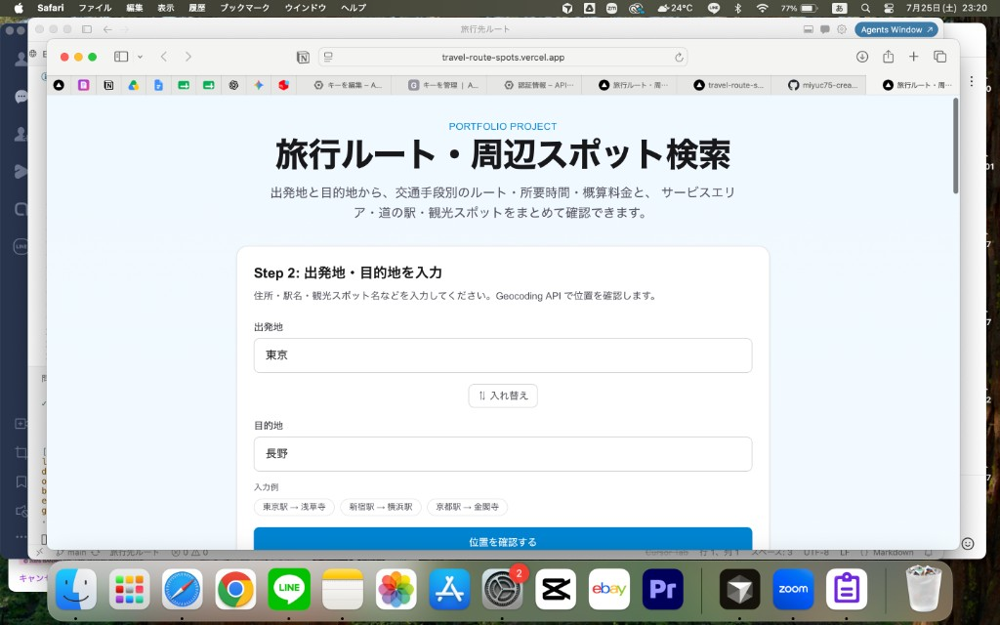
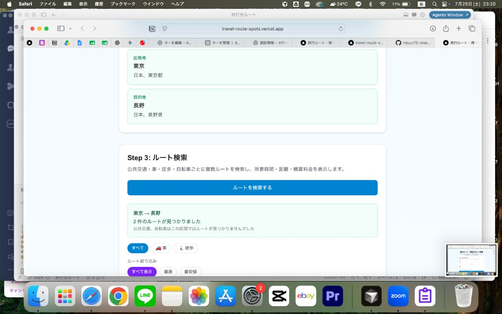
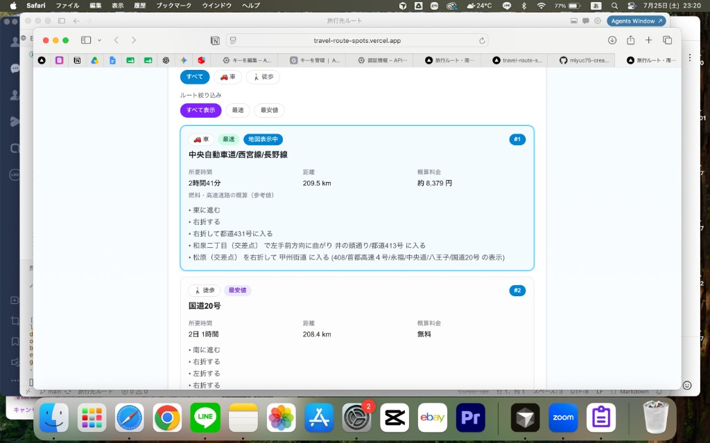
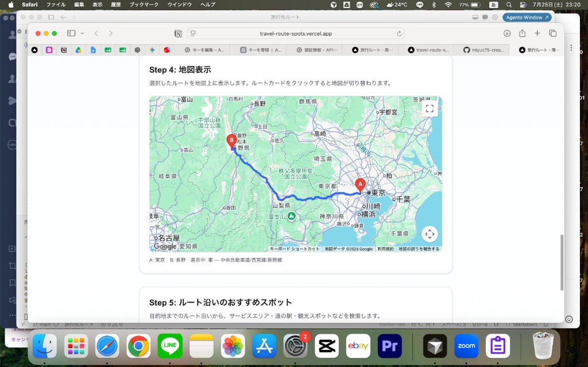
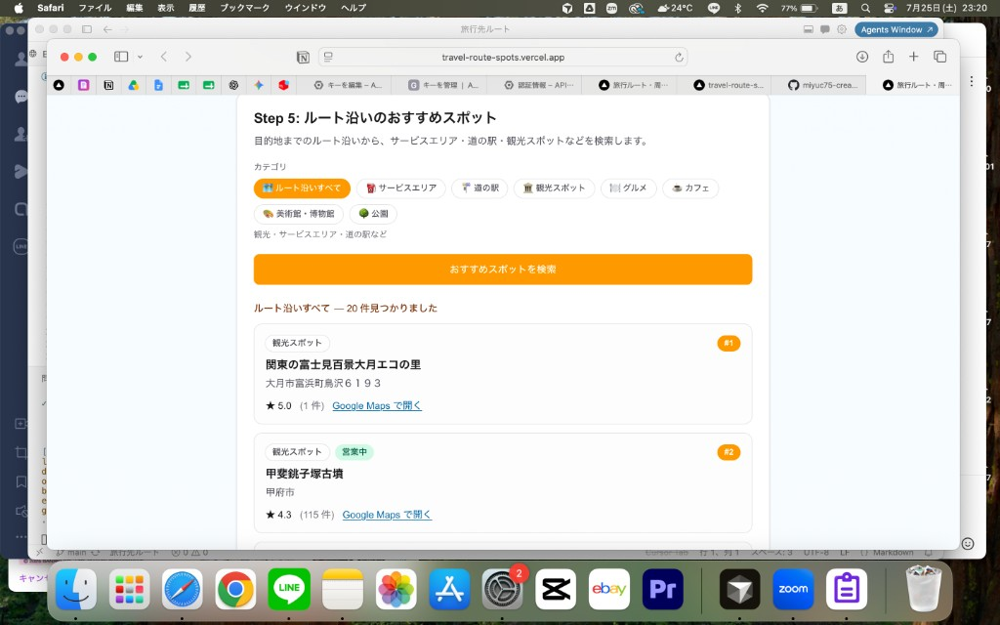

# 旅行ルート・周辺スポット検索

出発地と目的地から、交通手段別のルート・料金・所要時間・周辺スポットをまとめて確認できる Web アプリです。

## 公開デモ

**https://travel-route-spots.vercel.app**

**GitHub:** https://github.com/miyuc75-creator/travel-route-spots

## スクリーンショット

東京 → 長野 のルート検索を例に、入力から結果確認までの画面です。

| トップ・入力 | ルート検索 |
| --- | --- |
|  |  |

| ルート比較結果 | 地図表示 |
| --- | --- |
|  |  |

| ルート沿いのスポット検索 |
| --- |
|  |

## 解決する課題

旅行の計画時、経路検索と周辺スポットの調べ物を別々のアプリやサイトで行う必要があり、手間がかかります。  
本アプリでは、ルート検索と周辺スポット検索を一つの画面で行えるようにしました。

## 主な特徴

- 車・徒歩・自転車・公共交通の複数ルートを比較できる
- 所要時間・距離・概算料金を一覧で確認できる
- ルート沿いの観光地やサービスエリアなどを検索できる

## 技術的な工夫

- Google Maps API をサーバー用とブラウザ用のキーに分離した
- API キーを環境変数で管理し、GitHub に公開しない設計にした
- Next.js の API Route を使い、外部 API 呼び出しをサーバー側に分離した

---

## 機能

- 出発地・目的地の入力（住所・駅名・スポット名）
- 複数ルートの提示（車 / 徒歩 / 自転車 / 公共交通）
- 最速・最安値でのルート絞り込み
- 所要時間・距離・概算料金の表示
- ルート沿いのおすすめスポット（観光・サービスエリア・道の駅など）
- 地図上でのルート・スポットの可視化

## 技術スタック

| カテゴリ | 技術 |
|---------|------|
| フロントエンド | Next.js 16, React 19, TypeScript |
| スタイリング | Tailwind CSS 4 |
| 地図・ルート | Google Maps Platform |
| デプロイ | Vercel |

## ローカル開発

```bash
npm install
cp .env.example .env.local
# .env.local に API キーを設定
npm run dev
```

http://localhost:3000 でアクセスできます。

## 環境変数

| 変数名 | 用途 |
|--------|------|
| `GOOGLE_MAPS_API_KEY` | サーバーサイド（Geocoding / Directions / Places） |
| `NEXT_PUBLIC_GOOGLE_MAPS_API_KEY` | ブラウザ（Maps JavaScript API） |

## Vercel へのデプロイ

### 1. Vercel にインポート

1. [Vercel Dashboard](https://vercel.com/new) を開く
2. GitHub リポジトリ `travel-route-spots` をインポート
3. Framework Preset: **Next.js**（自動検出）
4. **Environment Variables** に以下を追加

```
GOOGLE_MAPS_API_KEY=（サーバー用キー）
NEXT_PUBLIC_GOOGLE_MAPS_API_KEY=（ブラウザ用キー）
```

5. **Deploy** をクリック

### 2. Google Cloud の本番設定

デプロイ後に表示される URL（例: `https://travel-route-spots.vercel.app`）を使い、API キーの制限を更新します。

**ブラウザ用キー（HTTP リファラー）**

```
http://localhost:3000/*
https://travel-route-spots.vercel.app/*
https://*.vercel.app/*
```

**サーバー用キー（API の制限）**

- Geocoding API
- Directions API
- Places API

### 3. CLI からデプロイ（任意）

```bash
npx vercel
npx vercel --prod
```

## Google Maps Platform API キーの取得

1. [Google Cloud Console](https://console.cloud.google.com/) でプロジェクトを作成
2. 請求先アカウントをリンク
3. 以下の API を有効化
   - Maps JavaScript API
   - Directions API
   - Places API
   - Geocoding API
4. 認証情報から API キーを 2 つ作成（サーバー用・ブラウザ用）

## ライセンス

MIT
